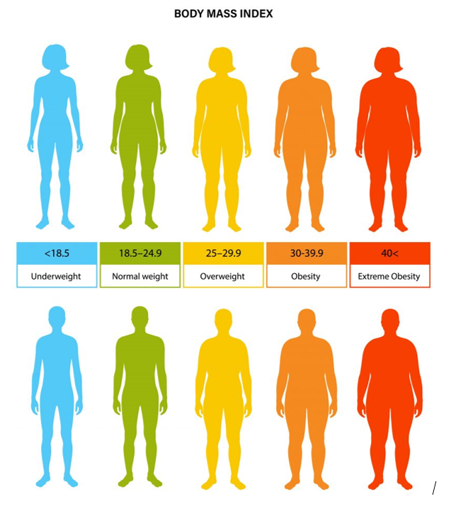
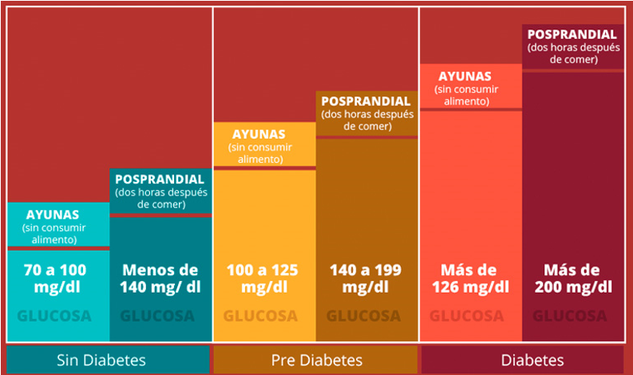
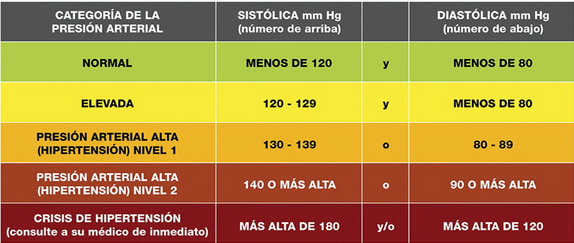

<table align="center"><tr><td colspan="4" align="center" width="9999">

# Clínica Digital

Código para el proyecto de Clínica digital
USUARIO: TEST
CONTRASEÑA: pass1234
<p align="center">
  
</p>

</td></tr></table>

## Tabla de Contenidos

- [Descripción](#descripción)
- [Requisitos](#requirements)
- [Instrucciones](#instrucciones)
- [Instalación](#installation)
- [Equipo](#equipo)

## Descripción

Aplicación que te dice tu horóscopo con tu nombre, apellido y fecha de nacimiento.

## Requisitos

* PHP
* Xampp

## Instrucciones

El consultorio clínico ABC desea elaborar un sitio web que le permita a sus pacientes tener un control de su IMC,
glucosa en sangre y presión arterial, considere que la entrada al sitio debe controlarla con un login, validando los
datos paciente usuario y contraseña, en donde la contraseña de acceso a validar es pass1234, luego de ingresar los datos
y validar la contraseña, debe mostrarle al paciente un mensaje de bienvenida, “Bienvenido usuario”, y presentarle el
menú con las opciones IMC, Glucosa en sangre y presión arterial (sea creativo en la presentación de las opciones).
Mediante cookies presente el nombre del usuario en las diversas páginas del sitio web. Cada una de las opciones del menú
debe desplegar una página en donde se ingresen los datos requeridos para dar el diagnóstico al paciente, y en cada una
de las páginas debe tener un contador de visitas para cada una de ellas, es decir, que cada opción tendrá un contador
independiente. Recuerde que todos los procesos debe llevarlos a cabo en una clase.

### Sobre IMC

Para la opción IMC el paciente debe proporcionar los siguientes datos peso(kg) y estatura (mts), tome en cuenta la
siguiente tabla de valores:
La fórmula para el IMC es el peso en kilogramos dividido por la estatura en metros cuadrados

```php
public function calcularIMC() {
  // TODO Buscar fórmula de IMC
  $imc = $this->peso / ($this->estatura * $this->estatura);
  $this->setImc($imc);
}
```

<p align="center">
  
</p>

### Sobre Glucosa

En el caso de la glucosa en sangre, el paciente debe ingresar la lectura del glucómetro e indicar si se tomó la lectura
en ayunas o posterior a las comidas (posprandial), utilice la siguiente tabla de valores para realizar el diagnóstico).

```php
   /*
        Pseudo Code

        Si Ayuna y 70 a 100 mg/dl
            Sin diabetes
        Si Posprandial y 140 mg/dl
            Sin diabetes
        Si Ayuna y 100 a 125 mg/dl
            Pre diabetes
        Si Posprandial y 140-199 mg/dl
            Pre diabetes
        Si Ayuna y >126 mg/dl
            Diabetes
        Si Posprandial y >200 mg/dl
            Diabetes

        */
```

<p align="center">
  
</p>

### Sobre Presión Arterial

Para el caso de la presión arterial, el paciente debe proporcionar la lectura de la presión sistólica y diastólica, tome
en cuenta la siguiente tabla de referencia para dar el diagnóstico al paciente

```php
        /*
        Pseudo Code

        Si PArterialSistolica < 120 mm Hg y PArterialDiastolica < 80 mm Hg
            Normal
        Si PArterialSistolica 120-129 mm Hg y PArterialDiastolica < 80 mm Hg
            Elevada
        Si PArterialSistolica 130-139 mm Hg y PArterialDiastolica 80-89 mm Hg
            Presión Arterial Alta
        Si PArterialSistolica >140 mm Hg y PArterialDiastolica >90 mm Hg
            Presión Arterial Alta (Hipertension) Nivel 2
        Si PArterialSistolica >180 mm Hg y PArterialDiastolica >120 mm Hg
            Crisis De Hipertensión

        */
```

<p align="center">
  
</p>

## Instalación

Clona el repositorio

```bash
git clone https://github.com/FernandoCutire/clinica-digital-arqui
```

Coloca la carpeta en tu carpeta htdocs ubicada en xampp

Enciende el servidor apache en tu xampp

Entra a localhost/nombre-carpeta

```bash
Por defecto está http://localhost/zodiaco-app/resources/views/inicio/inicio.php
```

## Equipo

Fernando Cutire Hellynger St. Rose